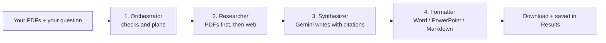

# AcadSynth

**Multi-Agent System for Collaborative Academic Synthesis** (Course: DSN4091, Group 153)

AcadSynth is a web app that writes a **cited research summary** for you. You give it your own PDF papers and a question. It reads your PDFs, searches the web for extra background, and produces a finished **Word, PowerPoint or Markdown file**.

---

## 1. The problem it solves

Writing a literature summary by hand means reading many papers, searching for background, and keeping track of where each fact came from. AcadSynth does the first draft of that work in about a minute, and **every statement in the report points back to a source** so you can check it.

---

## 2. What does "agentic AI" mean? (in plain words)

A normal chatbot answers one question in one step.

An **agentic** system splits a job into **several steps**, and each step is handled by a small **agent** with one clear responsibility. The agents pass their results to each other, like workers on an assembly line.

> **Analogy:** a newspaper. One person plans the story, one gathers facts, one writes it, and one lays out the page. Nobody does everything, and the result is better organised.

AcadSynth has **four agents**:

| # | Agent | Its one job | Real-life comparison |
|---|-------|-------------|----------------------|
| 1 | **Orchestrator** | Checks the setup (API key, which sources to use) and plans the run | The editor who assigns the work |
| 2 | **Researcher** | Finds information in your PDFs and on the web | The reporter who gathers facts |
| 3 | **Synthesizer** | Writes the cited summary using Google Gemini (an AI model) | The writer |
| 4 | **Formatter** | Turns the text into a .docx, .pptx or .md file and saves it | The page designer |



**Honest note for your faculty:** the four agents run in a fixed order. The most "agent-like" decision is made by the Researcher: it asks Gemini *what to search for on the web* based on what is inside your PDF, instead of just searching the question word for word.

---

## 3. How it works, step by step

1. **You upload PDFs.** The app cuts each PDF into small pieces (about 400 words) and turns each piece into a list of numbers that represents its *meaning* (this is called an **embedding**). These are stored in a local database (**ChromaDB**) on your computer.
2. **You ask a question** and choose what to use: *My PDFs and the web*, *Only my PDFs*, or *Only the web*.
3. **The Researcher looks in your PDFs first.**
   - A specific question ("What skills are listed in this resume?") finds the most similar pieces by meaning.
   - A vague question ("describe this", "summarize") reads the whole PDF.
   - If nothing in your PDFs matches the question, the app **stops and warns you** instead of quietly answering from the web.
4. **Then it searches the web.** Gemini reads an excerpt of your PDF and writes 2 or 3 short search queries (never including names, emails or phone numbers). The results come from DuckDuckGo.
5. **The Synthesizer writes the report.** Gemini gets your PDF content and the web results, and must cite each claim as `[PDF Source 1]` or `[Web Source 2]`. Web material goes in its own section, **"Additional context from the web"**, so it is never mixed up with your documents.
6. **The Formatter builds the file** and saves it in the `outputs/` folder. You can download it now or find it later on the **Results** page.

---

## 4. What the report looks like

- **Summary**
- 2 to 4 sections based on your PDFs
- **Additional context from the web** (only when web results were used)
- **References**: every source with its label, file name or title, and link

---

## 5. Pages in the app

| Page | What you do there |
|------|-------------------|
| **Overview** | See a setup checklist and your latest documents |
| **New query** | Upload PDFs, ask a question, create and download the document |
| **Results** | Re-download or delete any earlier document |
| **Settings** | Add your Gemini API key, choose the model, manage your PDF library |

---

## 6. Technology used

| Part | Tool | Why |
|------|------|-----|
| Web interface | [Streamlit](https://streamlit.io) | Build a web app with only Python |
| Writing model | Google Gemini (`google-genai`) | Writes the cited summary and plans web searches |
| PDF reading | PyMuPDF | Extracts the text from PDFs |
| Meaning search | `sentence-transformers` (`all-MiniLM-L6-v2`) | Turns text into embeddings, runs on your laptop for free |
| Database | ChromaDB | Stores embeddings and finds similar passages |
| Web search | `ddgs` (DuckDuckGo) | Free, no API key needed |
| Output files | `python-docx`, `python-pptx` | Build Word and PowerPoint files |

---

## 7. Project structure

```
acadsynth/
├── app.py                  Starts the app and sets up the menu
├── requirements.txt        List of packages to install
├── .streamlit/
│   ├── config.toml         Black and white theme
│   └── secrets.toml        Your Gemini API key (never uploaded to GitHub)
├── views/                  One file per page
│   ├── home.py             Overview page
│   ├── query.py            New query page
│   ├── results.py          Results page
│   └── settings.py         Settings page
└── utils/                  The "engine" behind the pages
    ├── agents.py           Runs the 4 agents in order
    ├── researcher.py       Agent 2: searches PDFs and the web
    ├── synthesizer.py      Agent 3: asks Gemini to write the report
    ├── formatter.py        Agent 4: builds .docx / .pptx / .md files
    ├── ingestor.py         Reads PDFs and stores them in ChromaDB
    ├── embedder.py         Turns text into embeddings
    ├── history.py          Saves every run in the outputs/ folder
    ├── config.py           API key, model and dropdown options
    ├── nav.py, ui.py       Small helpers
```

Folders created automatically when you use the app: `chroma_db/` (your PDF library) and `outputs/` (your finished documents).

---

## 8. How to run it (Windows, PowerShell)

**You need:** Python 3.10 or newer and a free Gemini API key.

1. **Get a key** at <https://aistudio.google.com/apikey>.
2. **Open a terminal** in the project folder and install the packages:
   ```powershell
   pip install -r requirements.txt
   ```
3. **Create the file `.streamlit/secrets.toml`** and put your key in it:
   ```toml
   GEMINI_API_KEY = "paste-your-key-here"
   ```
   (Or skip this and paste the key on the app's **Settings** page. That only lasts until you close the browser tab.)
4. **Start the app:**
   ```powershell
   streamlit run app.py
   ```
5. The app opens in your browser. Go to **New query**.

The first time you upload a PDF, the app downloads a small language model (about 80 MB). This happens once.

> **Never upload `secrets.toml` to GitHub.** It is already listed in `.gitignore`.

---

## 9. Try it

1. Upload a PDF paper.
2. Ask: *"What are the main findings of this paper?"*
3. Keep **My PDFs and the web** selected and press **Create document**.
4. Open the **Sources used** list. You should see `PDF Source` entries from your paper and `Web Source` entries with links.

---

## 10. Limitations

- **Text only.** It cannot look at images or describe a photo.
- **Scanned PDFs do not work** (a PDF that is only pictures of pages has no text to read).
- **Vague questions read only the first 10,000 words** of each selected PDF.
- **Web search is free but limited.** DuckDuckGo can occasionally return nothing or refuse a request.
- **Gemini's free plan has usage limits.** If it is busy, the app retries and tries a backup model automatically.
- **Check the output.** The report only uses the sources it was given, but AI can still misread them. The citations are there so you can verify.

---

## 11. How to explain this project in one minute

> "Our app is a multi-agent system. Instead of one AI doing everything, we split the work between four agents. The Orchestrator checks the setup, the Researcher finds information in the student's own PDFs and on the web, the Synthesizer uses Gemini to write a summary with citations, and the Formatter produces a Word or PowerPoint file. The PDFs are stored as embeddings in ChromaDB so the system can find passages by meaning. If the question does not match the PDFs, the system warns the user instead of guessing. Web results are kept in a separate section so the user always knows which facts came from their documents and which came from the internet."

---

## 12. Small glossary

| Word | Meaning |
|------|---------|
| **Agent** | A small program with one clear job inside a larger system |
| **Multi-agent system** | Several agents working together, each doing one step |
| **LLM** | Large Language Model, an AI that reads and writes text (here: Gemini) |
| **Embedding** | A list of numbers that represents the *meaning* of a piece of text |
| **Vector database** | A database that finds texts with similar meaning (here: ChromaDB) |
| **Synthesis** | Combining information from many sources into one summary |
| **Citation** | A label like `[PDF Source 1]` showing where a statement came from |
| **API key** | A password that lets the app use Gemini |